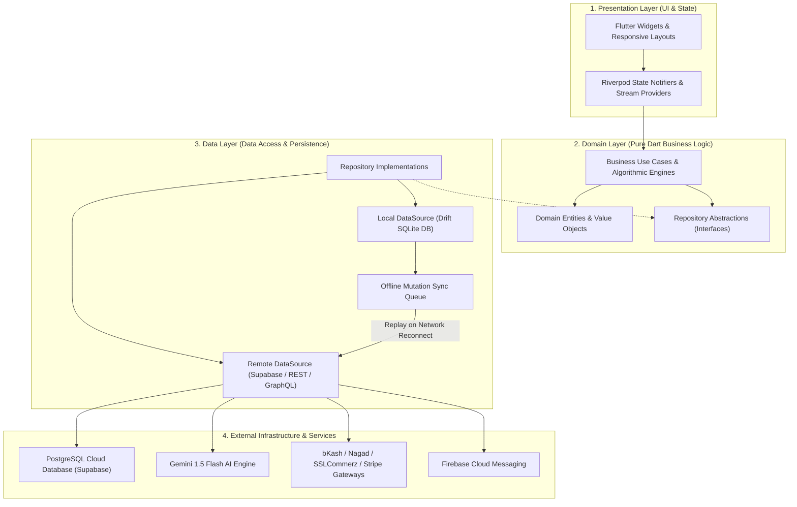

# 🏛️ Routine Flow: Software Architecture & Engineering Design

  

## 1. Architectural Philosophy & Principles

Routine Flow is built following **Clean Architecture**, **Domain-Driven Design (DDD)**, and the **Offline-First Reactive Paradigm**. The architecture enforces complete separation of concerns, high testability, and zero business-logic coupling to UI frameworks or backend providers.

---

## 2. Layer Responsibilities & Boundaries

### 2.1 Presentation Layer (`lib/features/*/presentation`)
- **Widgets**: Pure declarative Flutter widgets responsive across Mobile ($<600\text{dp}$), Tablet ($600-1024\text{dp}$), and Desktop ($>1024\text{dp}$).
- **State Management**: **Flutter Riverpod 2.x** with code-generation/StateNotifier providers ensuring unidirectional data flow and fine-grained UI rebuilds.
- **Routing**: **GoRouter** with declarative URI-based navigation, shell routes for responsive navigation bars, and deep-link handling.

### 2.2 Domain Layer (`lib/features/*/domain`)
- **Pure Dart**: Zero imports from `flutter/material.dart` or third-party database packages.
- **Entities**: Immutable data models with copy methods and equality contracts (`Equatable`).
- **Algorithms**:
  - `ConflictDetectionService`: $\mathcal{O}(N \log N)$ temporal overlap computation.
  - `FreeTimeService`: Calculates idle schedule slots suitable for focus study.

### 2.3 Data Layer (`lib/features/*/data`)
- **Repository Pattern**: Mediates between local Drift SQLite storage and remote cloud endpoints.
- **Offline-First Synchronization**:
  - Reads always hit local SQLite for $<16\text{ms}$ latency.
  - Writes apply locally first, then append an idempotent record to `sync_queue`.
  - When network is connected, background `SyncEngine` drains the mutation queue.

---

## 3. Data Flow & State Management Lifecycle

```mermaid
sequenceDiagram
    autonumber
    actor User
    participant View as UI Widget
    participant Notifier as Riverpod Notifier
    participant Repo as ActivityRepository
    participant DB as Drift SQLite Local DB
    participant Sync as SyncEngine
    participant Cloud as Supabase / Cloud API

    User->>View: Taps "Add Class Activity"
    View->>Notifier: createActivity(activity)
    Notifier->>Repo: createActivity(activity)
    Repo->>DB: INSERT INTO activities
    Repo->>DB: INSERT INTO sync_queue (mutation: CREATE, payload)
    DB-->>Repo: Success
    Repo-->>Notifier: Activity Entity
    Notifier-->>View: UI Updates Instantly (<16ms)
    
    rect rgb(30, 40, 60)
    Note over Sync,Cloud: Background Network Synchronization
    Sync->>Sync: On Network Online
    Sync->>DB: SELECT * FROM sync_queue WHERE status = 'pending'
    Sync->>Cloud: POST /rest/v1/activities (Idempotent Upsert)
    Cloud-->>Sync: 201 Created
    Sync->>DB: DELETE FROM sync_queue WHERE id = mutation_id
    end
```

---

## 4. Algorithmic Specifications

### 4.1 Schedule Conflict Detection Formula
Given a set of $N$ daily activities $\{A_1, A_2, \dots, A_N\}$ where each activity $A_i$ has a start time $S_i$ and end time $E_i$:
1. Sort activities chronologically by $S_i$.
2. For each pair $(A_i, A_j)$ where $i < j$:
   $$\text{IsConflict}(A_i, A_j) = (S_i < E_j) \land (S_j < E_i)$$
3. If true, flag conflict with overlap duration $D = \min(E_i, E_j) - \max(S_i, S_j)$.

### 4.2 Adaptive Free-Time Slot Allocation
1. Define active day boundary: $T_{\text{start}} = 06:00$, $T_{\text{end}} = 23:00$.
2. Merge overlapping busy intervals into sorted disjoint blocks $B_1, B_2, \dots, B_K$.
3. Compute gaps:
   $$G_0 = [T_{\text{start}}, S(B_1)], \quad G_k = [E(B_k), S(B_{k+1})], \quad G_K = [E(B_K), T_{\text{end}}]$$
4. Filter gaps where $\text{Duration}(G) \ge 45\text{ minutes}$ and mark as candidate focus study slots.

---

## 5. Security & Threat Model

- **Device Data Encryption**: Local SQLite database is encrypted using SQLCipher with AES-256 keys secured in OS Keyring / Keychain.
- **Row Level Security (RLS)**: Enforced directly on PostgreSQL to ensure complete multi-tenant student isolation.
- **API Boundary Protection**: Edge functions validate JWT tokens and user subscription tiers before dispatching AI prompts.
