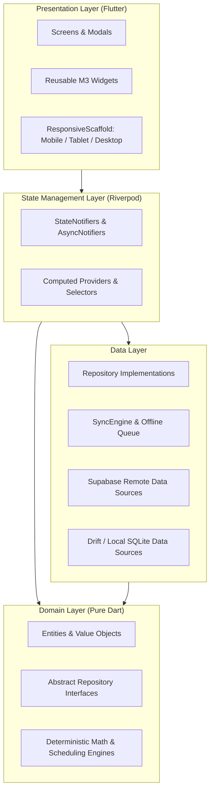

# ROUTINE FLOW - Technical Architecture & Engineering Specification

## 1. Architectural Principles

Routine Flow is built on four core engineering pillars:
1. **Offline-First Guarantee**: All user operations (create, update, complete, delete) succeed instantly on local SQLite storage, then enqueue for remote reconciliation.
2. **Multi-Tenant University Isolation**: University timetables, courses, and announcements are partitioned strictly by `university_id` with PostgreSQL Row-Level Security (RLS).
3. **Deterministic Scheduling Engine**: The mathematical core (`ConflictDetectionService`, `FreeTimeService`, `RecurrenceEngine`) operates deterministically across all client platforms.
4. **Predictive AI Interleaving**: LLMs are utilized strictly for heuristic optimization (study block placement, energy matching), while conflict detection remains hard-coded and mathematically provable.

---

## 2. Layered Architecture



---

## 3. Row-Level Security (RLS) Specification

```sql
-- Personal Activities Isolation
CREATE POLICY "Users can manage personal activities" ON activities
    FOR ALL USING (
        user_id = auth.uid() 
        OR (university_id IS NOT NULL AND is_university_admin(university_id))
    );

-- University Read Access by Campus Membership
CREATE POLICY "Users can view personal activities and university classes" ON activities
    FOR SELECT USING (
        user_id = auth.uid() 
        OR (university_id IS NOT NULL AND university_id IN (SELECT university_id FROM profiles WHERE id = auth.uid()))
        OR is_super_admin()
    );
```
