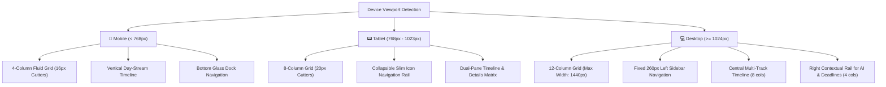

# 🎨 Routine Flow: Google Stitch Design System & UI Architecture

  

## 1. Design System Metadata (Google Stitch)
- **Stitch Project ID**: `4817750500580553492` ("Routine Flow - Unified Student Operating System")
- **Design System Asset ID**: `assets/49e4b6db3a45463a876ea67b743b140e`
- **Design Theme**: Dark Mode Glassmorphism with Technical Precision
- **Primary Typography**: **Plus Jakarta Sans** (Headlines & Badges) + **Inter** (Data & Body)

---

## 2. Color Palette & Tonal Hierarchy

| Token Name | Hex Code | Role & Usage |
| :--- | :--- | :--- |
| **`surface`** | `#0B1326` / `#0F172A` | Base deep obsidian canvas providing high-contrast without OLED harshness. |
| **`surface-container`** | `#171F33` / `#182234` | Resting container background for schedule lists and modular panels. |
| **`surface-card`** | `rgba(30, 41, 59, 0.70)` | Frosted glassmorphic card fill with `backdrop-filter: blur(12px)`. |
| **`primary (Electric Sky)`** | `#38BDF8` | Active focus sessions, live countdown rings, primary button fills. |
| **`secondary (Vibrant Violet)`** | `#6366F1` | AI routine generator, smart revision planner, algorithms. |
| **`tertiary (Emerald Momentum)`** | `#10B981` | Completed tasks, streak checkmarks, discovered free-time gaps. |
| **`alert-warning (Amber)`** | `#F59E0B` | Schedule overlap alerts, buffer warnings. |
| **`alert-danger (Rose)`** | `#F43F5E` | Immediate schedule clash, overdue lab submission. |
| **`border-subtle`** | `rgba(255, 255, 255, 0.08)` | 1px hairline border for frosted containers and input fields. |

---

## 3. Responsive Breakpoint & Layout System

---

## 4. Component Design Specifications

### 4.1 'My Day' Active Focus Card
- **Background**: Frosted glass (`#1E293B` at 70% opacity) with gradient border (`#38BDF8` to `#6366F1`).
- **Live Indicator**: Emerald pulsing dot with `'IN PROGRESS NOW'` badge.
- **Timer Readout**: High-contrast tabular numbers (`1h 24m left`) with dynamic progress bar.
- **Action Buttons**: Primary Electric Sky `'Mark Done'` button + `'Lecture Notes'` glass pill.

### 4.2 Visual Free-Time Discovery Widget
- **Background**: Soft Emerald gradient tint (`linear-gradient(135deg, rgba(16,185,129,0.15), transparent)`).
- **Metric**: Highlights non-overlapping idle intervals $(>45\text{m})$ between university lectures.
- **CTA**: 1-tap `'Schedule Focus Study'` or `'Add Workout Session'`.

### 4.3 Schedule Conflict Callout Banner
- **Background**: Amber/Rose glow border with warning triangle icon.
- **Text**: Displays exact overlapping courses (e.g., *'Machine Learning Lab vs Campus Career Fair'*).
- **CTA**: 1-tap `'Resolve with Flow AI'` for automated slot rebalancing.

---

## 5. Screen Blueprints in Google Stitch

1. **My Day Unified Mobile Dashboard** (`af77311c9a5c4a92ac0a8e16503ae333`):
   - Header with brand avatar, date slider, filter chips, active class card, next up banner, and chronological daily timeline.
2. **University Academic Routine Hub**:
   - Department routine matrix, room allocations, instructor contacts, and exam countdowns.
3. **AI Intelligent Routine Planner**:
   - OCR timetable ingestion zone, exam study plan generator, and natural language schedule assistant.
4. **Unified Desktop & Tablet Command Center**:
   - 12-column widescreen layout with fixed navigation sidebar and live contextual assistant rail.
