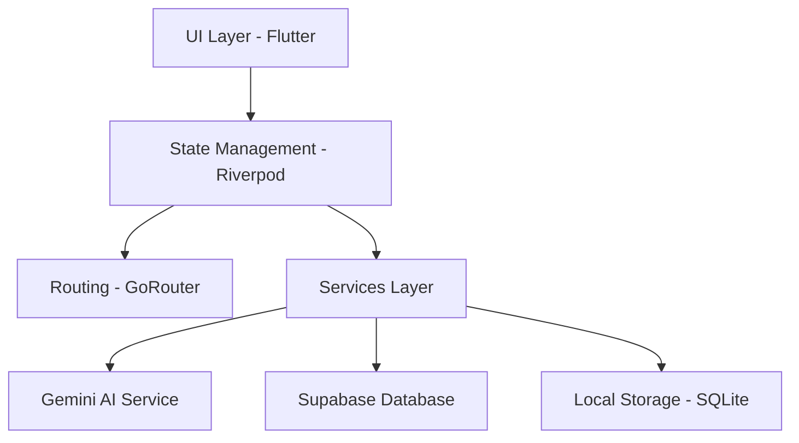

<p align="center">
  
</p>

<p align="center">
  <a href="https://github.com/Ti838/RoutineFlow-App/actions/workflows/android.yml">
    
  </a>
</p>

# RoutineFlow 🚀

RoutineFlow is an advanced, AI-powered productivity and academic management suite designed to elevate your time management, routine tracking, and university schedules. This project features a clean, responsive, and pro-level UI built natively with Flutter.

## 🌟 Key Features
- **Smart Authentication**: Premium Google and Apple sign-in UI, built for scalability.
- **My Day Dashboard**: A beautiful, at-a-glance view of daily routines and quick actions.
- **University Suite**: Keep track of timetables, subjects, and exams without breaking a sweat.
- **AI Planner (Gemini OCR)**: Upload a picture of a syllabus or timetable, and watch Gemini seamlessly parse and organize it.
- **Production-Ready Architecture**: Clean architecture, Riverpod for state management, and GoRouter for elegant navigation.

## 📐 Architecture Diagram



## 🛠 Tech Stack
- **Framework**: [Flutter](https://flutter.dev/) (Dart)
- **State Management**: [Riverpod](https://riverpod.dev/)
- **Routing**: [GoRouter](https://pub.dev/packages/go_router)
- **Database Backend**: [Supabase](https://supabase.com/)
- **AI Engine**: Google Gemini 

## 📦 Building & Running
To run this project locally on a device, emulator, or web:

```bash
flutter pub get
flutter run
```

To build a release APK:
```bash
flutter build apk --release
```

## 🎨 UI Overview
The application follows a modern **Material 3** design language, using a custom dynamic color palette and Google Fonts (`Poppins` and `Inter`) to give it a sharp, professional look. The app prominently features the **RoutineFlow Logo** across the splash screen, auth screen, and headers.

---
*Built with ❤️ by **TIMON**.*
