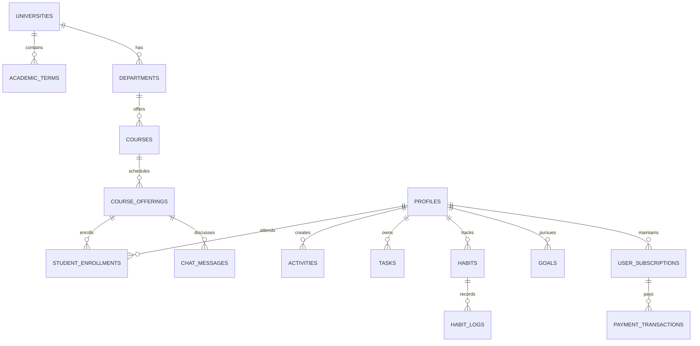

<p align="center">
  
</p>

<h1 align="center">ROUTINE FLOW</h1>

<p align="center">
  <strong>Personal Routine + University Routine = One Unified Daily Schedule</strong>
</p>

<p align="center">
  <em>Answering one vital question with precision: "What should I do now, and what do I need to do next?"</em>
</p>

<p align="center">
  
  
  
  
  
  
</p>

---

## 📑 Executive Table of Contents
1. [Vision & Brand Philosophy](#-vision--brand-philosophy)
2. [Problem Statement & The Unified Solution](#-problem-statement--the-unified-solution)
3. [System Architecture & Clean Design](#-system-architecture--clean-design)
4. [Ecosystem & Core Subsystems](#-ecosystem--core-subsystems)
   - [A. Unified 'My Day' Temporal Engine](#a-unified-my-day-temporal-engine)
   - [B. University Routine Hub & Schedule Sync](#b-university-routine-hub--schedule-sync)
   - [C. AI Intelligence & Automated Timetable Parser](#c-ai-intelligence--automated-timetable-parser)
   - [D. Real-Time Collaboration & Class Chatrooms](#d-real-time-collaboration--class-chatrooms)
   - [E. Payment Gateway & Monetization Strategy](#e-payment-gateway--monetization-strategy)
   - [F. Offline-First Drift SQLite & Cloud Sync](#f-offline-first-drift-sqlite--cloud-sync)
5. [Database Schema & Multi-Tenant Design](#-database-schema--multi-tenant-design)
6. [Codebase & Directory Index](#-codebase--directory-index)
7. [Getting Started & Installation](#-getting-started--installation)
8. [Comprehensive Documentation Directory](#-comprehensive-documentation-directory)
9. [Release & Production Build Manual](#-release--production-build-manual)
10. [Licensing & Roadmap](#-licensing--roadmap)

---

## 🌟 Vision & Brand Philosophy

University students operate in an increasingly fragmented digital ecosystem. Academic routines and lecture room allocations are shared via PDFs or student portals, personal habits are logged in separate habit trackers, to-dos sit in unprioritized note apps, and class notices get lost in crowded chat threads.

**ROUTINE FLOW** synthesizes all academic obligations and personal life commitments into a single, cohesive, chronological timeline. It acts as an intelligent daily cockpit that empowers students to maintain high academic performance while preserving personal health, fitness, and career goals.

```mermaid
graph TD
    Root["🎯 Routine Flow Platform"] --> Uni["🏫 University Stream"]
    Root --> Pers["⚡ Personal Stream"]
    Root --> Intel["🤖 Intelligence Layer"]
    Root --> Collab["💬 Collaboration & Social"]
    Root --> Pay["💳 Monetization & Payments"]

    Uni --> U1["Auto-import Academic Routine"]
    Uni --> U2["Course Offerings & Section Sync"]
    Uni --> U3["Exam Countdown & Deadlines"]
    Uni --> U4["Class Announcements & CR Updates"]

    Pers --> P1["Flexible & Fixed Daily Habits"]
    Pers --> P2["Ad-hoc Tasks & Prioritization"]
    Pers --> P3["Daily Goal Alignment"]
    Pers --> P4["Focus Timers & Streaks"]

    Intel --> I1["AI Routine Parser (OCR/PDF/Text)"]
    Intel --> I2["Clash & Conflict Detection"]
    Intel --> I3["Adaptive Free-Time Slot Allocation"]
    Intel --> I4["Intelligent Habit Nudges"]

    Collab --> C1["Class Study Circles"]
    Collab --> C2["Realtime Group Discussion"]
    Collab --> C3["Resource & Note Sharing"]

    Pay --> M1["Freemium Core Student Tier"]
    Pay --> M2["Pro AI Student Subscription"]
    Pay --> M3["Local Payments (bKash/Nagad/SSLCommerz)"]
    Pay --> M4["Global Cards & App Stores"]
```



---

## 🎯 Problem Statement & The Unified Solution

| User Challenge | Fragmented Workaround | Routine Flow Unified Solution |
| :--- | :--- | :--- |
| **Scattered Timetables** | Checking WhatsApp for class updates + Google Calendar for personal tasks | **Unified Daily Timeline**: Class periods & personal blocks merge into one active schedule. |
| **Schedule Clashes** | Booking personal appointments during surprise makeup classes | **Zero-Clash Algorithm**: Instant conflict detection with automated alternatives. |
| **Manual Routine Entry** | Manually typing 40+ lecture slots each semester | **AI Routine Ingestion**: Parse PDF/Image timetable into structured database in seconds. |
| **No Internet in Classrooms** | Inaccessible cloud-only apps | **Offline-First Drift SQLite**: Zero frame drops, instant loading, auto-sync when online. |
| **Class Notices Lost in Noise** | Important exam dates lost in general chats | **Realtime Class Channels**: Dedicated course & batch chat rooms with pinned deadlines. |

---

## 🏗️ System Architecture & Clean Design

Routine Flow strictly implements **Clean Architecture** and the **Offline-First Reactive Paradigm**:

```mermaid
graph TB
    subgraph Presentation Layer [Presentation Layer (Flutter / Riverpod)]
        UI["Screens & Widgets (MyDay, University, Habits, Tasks, Profile)"]
        State["State Notifiers & Providers (Riverpod)"]
    end

    subgraph Domain Layer [Domain Layer (Core Business Logic)]
        Entities["Domain Models (Activity, CourseOffering, Habit, Task)"]
        Repos["Repository Interfaces"]
        ConflictEngine["Conflict Detection & Free-Time Engine"]
    end

    subgraph Data Layer [Data Layer (Local & Remote Sources)]
        RepoImpl["Repository Implementations"]
        DriftDB["Drift / SQLite Local DB (Offline Cache)"]
        SyncQ["Offline Mutation Queue"]
    end

    subgraph Cloud Backend [Cloud Backend & Microservices]
        Supabase["Supabase REST / Realtime / PostgreSQL RLS"]
        AIService["AI Engine (Gemini 1.5 Flash / OpenAI Vision)"]
        PaymentAPI["Payment Gateways (bKash, Nagad, Stripe, SSLCommerz)"]
        PushService["Push Notification Service (FCM)"]
    end

    UI --> State
    State --> Repos
    Repos --> Entities
    ConflictEngine --> Entities
    State --> ConflictEngine
    RepoImpl -.-> Repos
    RepoImpl --> DriftDB
    RepoImpl --> SyncQ
    SyncQ -->|Auto-Replay on Connect| Supabase
    RepoImpl --> Supabase
    RepoImpl --> AIService
    RepoImpl --> PaymentAPI
    RepoImpl --> PushService
```

---

## 🚀 Ecosystem & Core Subsystems

### A. Unified 'My Day' Temporal Engine
- **Active Focus Card**: Live countdown, location, course instructor, and quick complete actions.
- **Next Up Banner**: Real-time buffer counter showing exact time remaining before the next commitment.
- **Visual Free-Time Discovery**: Automatically computes non-overlapping idle intervals $(>45\text{ mins})$ between $06:00$ and $23:00$ and suggests optimal study/habit sessions.
- **Smart Conflict Alerts**: Detects temporal overlaps using interval logic:
  $$\text{Conflict}(A, B) = (S_A < E_B) \land (S_B < E_A)$$

### B. University Routine Hub & Schedule Sync
- **Multi-Tenant Hierarchy**: Supports multi-university, department, semester, and batch filtering.
- **Class Schedules**: Displays room numbers, faculty contact details, building codes, and course credits.
- **Exams & Deadlines**: Midterm, Final, and Assignment trackers with countdown badges.

### C. AI Intelligence & Automated Timetable Parser
- **OCR Timetable Ingestion**: Ingests timetable photos or PDFs using Gemini 1.5 Flash / Vision OCR and returns structured `List<UniversityRoutineSlot>`.
- **Exam Study Blueprint**: Decomposes exam syllabi into daily 45-minute Pomodoro study sessions placed inside identified free-time gaps.
- **Conversational Assistant**: Natural language schedule rescheduling and productivity queries.

### D. Real-Time Collaboration & Class Chatrooms
- **Batch Announcement Channel**: Read-only official announcements by Class Representatives (CR).
- **Course Q&A Channels**: Course-specific discussion threads for study questions and notes sharing.
- **Peer 1-on-1 Messaging**: Direct communication between classmates for study groups.

### E. Payment Gateway & Monetization Strategy
- **Local Payment Gateways**: bKash Tokenized Checkout, Nagad Direct Pay, SSLCommerz, Shurjopay.
- **Global & Mobile In-App**: Stripe Checkout, Google Play Billing, Apple StoreKit.
- **Tier Structure**:
  - **Free Tier**: Complete local routine management, habits, tasks, offline storage.
  - **Pro Tier (৳150 / \$1.99 mo)**: AI Timetable OCR, Smart Exam Planner, Cloud Sync, Study Groups.
  - **Campus Enterprise**: Department-level routine management & bulk student licensing.

### F. Offline-First Drift SQLite & Cloud Sync
- **Sub-16ms Query Latency**: Immediate UI responsiveness regardless of cellular signal quality.
- **Mutation Queue**: Offline edits are persisted to a transactional `sync_queue` table and automatically replayed with idempotent upserts upon reconnection.

---

## 🗄️ Database Schema & Multi-Tenant Design



---

## 📂 Codebase & Directory Index

```
ROUTINEFLOW-APP/
├── assets/
│   ├── icons/                   # Vector & PNG application icons
│   └── images/
│       ├── logo.png             # Official Routine Flow branding
│       └── app_logo.png         # High-resolution vector render
├── lib/
│   ├── app/
│   │   ├── config/              # Environment config & constants
│   │   ├── router/              # Declarative GoRouter routing table
│   │   └── theme/               # Dark & light theme palettes & typography
│   ├── core/
│   │   ├── database/            # Drift SQLite database schema & tables
│   │   ├── errors/              # AppException & Failure hierarchy
│   │   ├── network/             # Connectivity stream listener
│   │   ├── responsive/          # Mobile, Tablet, Desktop adaptive scaffold
│   │   ├── services/            # Notification & local storage services
│   │   └── sync/                # Offline mutation sync engine
│   ├── features/
│   │   ├── activities/          # Schedule timeline, calendar & clash engine
│   │   ├── ai_planner/          # AI prompt interfaces & plan generators
│   │   ├── auth/                # Login, registration, splash & onboarding
│   │   ├── collaboration/       # Real-time study groups & class chat
│   │   ├── goals/               # Long-term academic & life objectives
│   │   ├── habits/              # Habit tracking, streaks & daily logs
│   │   ├── home/                # 'My Day' unified operational cockpit
│   │   ├── subscription/        # Monetization, checkout & tier management
│   │   ├── tasks/               # Priority task manager & checklists
│   │   └── university/          # Routine explorer, courses & exams
│   └── shared/
│       └── widgets/             # Reusable UI cards, buttons, AppLogo, dialogs
├── supabase/
│   ├── migrations/              # 001_schema, 002_rls, 003_seed
│   └── functions/               # AI planner Deno edge function
├── test/                        # Comprehensive unit & widget test suites
├── ARCHITECTURE.md              # System design & Clean Architecture document
├── CODE_MAP.md                  # Complete file-by-file codebase index
├── PRD.md                       # Product Requirements Document
├── SRS.md                       # Software Requirements Specification (IEEE 830)
├── SYSTEM_BLUEPRINT.md          # Technical integration manual (AI/DB/Payments/Chat)
├── SETUP_GUIDE.md               # Local environment setup & deployment manual
├── API_DOCS.md                  # REST, WebSocket & Database API specifications
└── CONTRIBUTING.md               # Engineering & pull request guidelines
```

---

## 🚀 Getting Started & Installation

### Prerequisites
- **Flutter SDK**: `>= 3.27.0` ([Install Guide](https://docs.flutter.dev/get-started/install))
- **Dart SDK**: `>= 3.6.0`
- **Android Studio** / **VS Code** with Flutter extensions
- **Connected Physical Device** or **Android/iOS Emulator**

### Quickstart Commands
```bash
# 1. Clone the repository
git clone https://github.com/Ti838/RoutineFlow-App.git
cd RoutineFlow-App

# 2. Fetch dependencies
flutter pub get

# 3. Execute all unit tests
flutter test

# 4. Perform static code analysis (0 errors, 0 warnings)
dart analyze

# 5. Launch the application
flutter run
```

---

## 📚 Comprehensive Documentation Directory

| Document | Purpose & Scope |
| :--- | :--- |
| [📘 **PRD.md**](PRD.md) | Product strategy, user personas, UX philosophy, and business KPIs. |
| [📐 **SRS.md**](SRS.md) | IEEE 830-compliant software requirements, formulas, and security specs. |
| [🏛️ **ARCHITECTURE.md**](ARCHITECTURE.md) | Clean Architecture patterns, state management, and caching strategies. |
| [🛠️ **SYSTEM_BLUEPRINT.md**](SYSTEM_BLUEPRINT.md) | Deep technical integration guide for AI, Databases, Payments & Chat. |
| [🗺️ **CODE_MAP.md**](CODE_MAP.md) | Comprehensive index of every source file, class, and method. |
| [⚙️ **SETUP_GUIDE.md**](SETUP_GUIDE.md) | Step-by-step local machine and backend deployment manual. |
| [📡 **API_DOCS.md**](API_DOCS.md) | Comprehensive REST, Edge Function, and WebSocket endpoint specifications. |
| [🤝 **CONTRIBUTING.md**](CONTRIBUTING.md) | Engineering standards, branch naming conventions, and review workflow. |

---

## 📦 Release & Production Build Manual

To generate an optimized, lightweight production build for release:

```bash
# Optimized Android Release APK (Split by CPU architecture: ~12-16 MB)
flutter build apk --release --split-per-abi

# Android App Bundle for Google Play Store upload
flutter build appbundle --release

# iOS Release Archive (macOS required)
flutter build ipa --release

# Production Web Build
flutter build web --release
```

---

## 🗺️ Licensing & Roadmap

- [x] **Phase 1: Foundation (Current MVP)**
  - Unified My Day dashboard uniting university + personal routines.
  - Offline-first SQLite database with conflict detection algorithms.
  - Official brand icon integration across all operating systems.
  - 100% test pass rate and 0 lint warnings.
- [ ] **Phase 2: Realtime Cloud & Peer Chat Collaboration**
  - Supabase/Firebase live synchronization.
  - Class batch & course-specific chatrooms for instant notice sharing.
- [ ] **Phase 3: Deep AI Assistant & Timetable OCR**
  - Instant PDF/Image timetable import with Gemini Vision OCR.
  - Natural language conversational assistant for daily productivity.
- [ ] **Phase 4: Monetization & University Portals**
  - bKash, Nagad, Stripe checkout integrations.
  - Institutional Admin Portal for automatic department routine publishing.

---

<p align="center">
  <strong>Routine Flow</strong> &copy; 2026. Built with precision for students worldwide.
</p>
