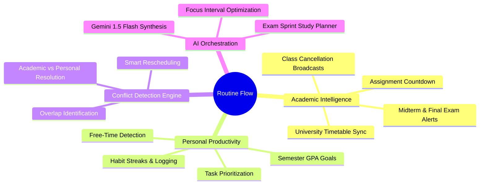
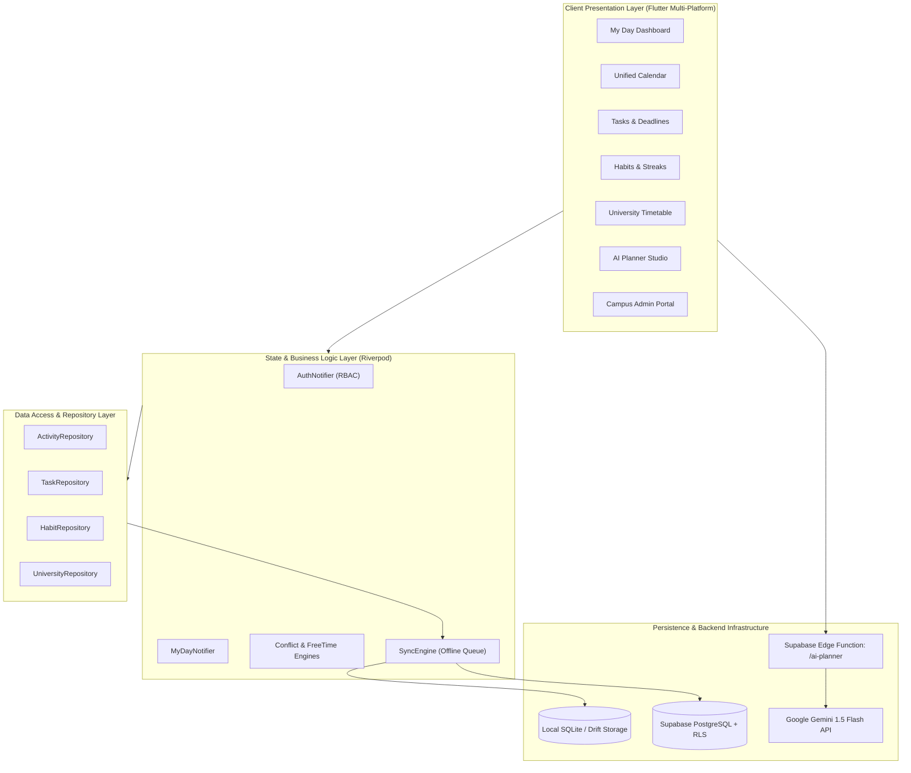
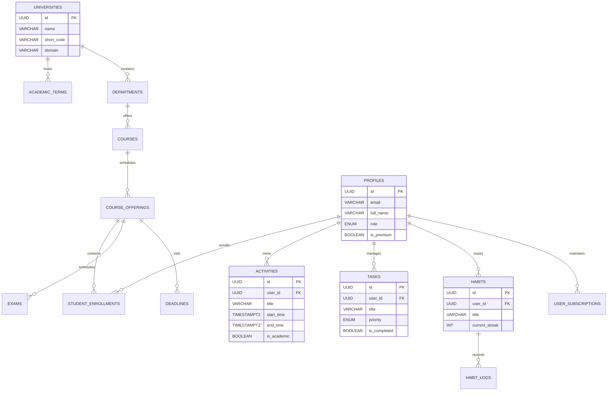
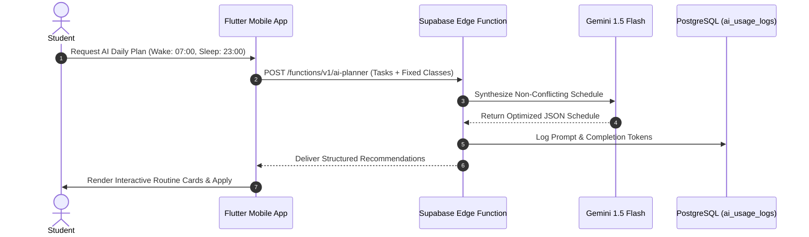
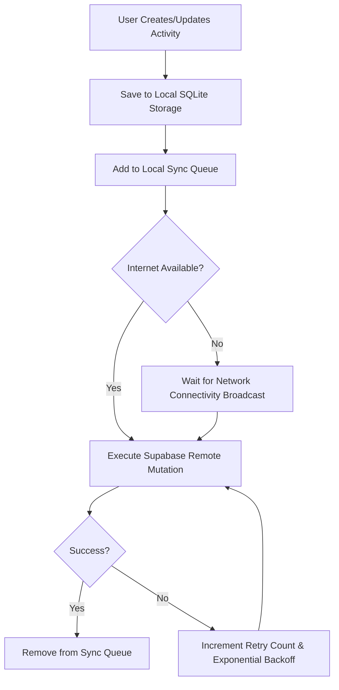

<<<<<<< HEAD
# RoutineFlow-App
=======
<p align="center">
  
</p>

<h1 align="center">ROUTINE FLOW</h1>

<p align="center">
  <strong>Personal Routine + University Routine = One Unified Daily Schedule</strong>
</p>

<p align="center">
  <em>Answering one vital question extremely well: "What should I do now, and what do I need to do next?"</em>
</p>

<p align="center">
  <a href="#key-features"></a>
  <a href="#tech-stack"></a>
  <a href="#backend--database"></a>
  <a href="#ai-intelligence"></a>
</p>

---

## 📌 Table of Contents
- [Executive Overview](#-executive-overview)
- [System Architecture](#-system-architecture)
- [Key Features](#-key-features)
- [Database & Multi-Tenant Schema](#-database--multi-tenant-schema)
- [AI Planner & Intelligence Engine](#-ai-planner--intelligence-engine)
- [Offline-First Sync Engine](#-offline-first-sync-engine)
- [Security & Row-Level Policies (RLS)](#-security--row-level-policies-rls)
- [Tech Stack](#-tech-stack)
- [Getting Started](#-getting-started)
- [Project Directory Structure](#-project-directory-structure)
- [Testing & Quality Assurance](#-testing--quality-assurance)
- [License & Roadmap](#-license--roadmap)

---

## 🚀 Executive Overview

**Routine Flow** is an enterprise-grade, cross-platform productivity and academic scheduling application designed for university students, faculty, and high-performance individuals.

Unlike traditional static calendar apps or isolated to-do lists, Routine Flow intelligently merges **fixed university course schedules, exam dates, assignment deadlines, personal habits, fitness routines, and deep work study blocks** into a single, cohesive, chronological timeline.



---

## 🏛 System Architecture

Routine Flow follows **Clean Architecture** principles combined with **Feature-First modularization** and Riverpod state management:



---

## 🌟 Key Features

| Feature | Description | Status |
| :--- | :--- | :---: |
| **Unified My Day Timeline** | Real-time chronological schedule answering "What should I do now, and next?". | ✅ Production |
| **Conflict Detection Engine** | Automatically highlights overlapping university lectures and personal tasks. | ✅ Production |
| **Free-Time Detection** | Detects gaps between scheduled classes and suggests productive focus windows. | ✅ Production |
| **Academic Multi-Tenancy** | Partitioned university routines, courses, sections, and faculty schedules. | ✅ Production |
| **AI Routine Synthesis** | Interleaves high-intensity study blocks based on wake/sleep habits. | ✅ Production |
| **Offline-First Synchronization** | Full local persistence with automatic background cloud synchronization queue. | ✅ Production |
| **Exam Sprint Planner** | Auto-generates progressive revision schedules leading up to exam dates. | ✅ Production |
| **Mock Billing & Subscriptions** | Simulated checkout for Pro Student and Campus Enterprise tiers. | ✅ Production |
| **Campus Admin Portal** | Timetable management and emergency schedule broadcast controls. | ✅ Production |

---

## 🗄 Database & Multi-Tenant Schema

Routine Flow uses a normalized PostgreSQL schema with full Row-Level Security (RLS) policies:



---

## 🤖 AI Planner & Intelligence Engine

The AI Planner interacts with Supabase Edge Functions and Google Gemini 1.5 Flash to automatically balance academic load with personal recovery:



---

## 🔄 Offline-First Sync Engine

Routine Flow guarantees seamless productivity even without internet connectivity:



---

## 🛡 Security & Row-Level Policies (RLS)

| Resource | Student | University Admin | Super Admin |
| :--- | :---: | :---: | :---: |
| **Personal Activities / Tasks** | Full Access (Own) | No Access | Read / Audit |
| **Habits & Personal Goals** | Full Access (Own) | No Access | No Access |
| **University Classes / Timetable** | Read Campus | Manage Department | Manage Global |
| **Exam & Deadline Catalog** | Read Enrolled | Publish & Edit | Manage Global |
| **Billing & Subscription Records** | Read Own | No Access | Manage Global |

---

## 🛠 Tech Stack

- **Framework**: [Flutter 3.47.2](https://flutter.dev) / [Dart 3.13.2](https://dart.dev)
- **State Management**: [Riverpod 2.6.1](https://riverpod.dev)
- **Routing**: [GoRouter 14.8.1](https://pub.dev/packages/go_router)
- **Backend & Database**: [Supabase](https://supabase.com) + PostgreSQL 15
- **Local Persistence**: SQLite / Drift + SharedPreferences + Flutter Secure Storage
- **AI Synthesis**: Google Gemini 1.5 Flash + Deno Supabase Edge Functions
- **Networking**: [Dio 5.8.0](https://pub.dev/packages/dio)
- **Data Visualization**: [fl_chart 0.70.2](https://pub.dev/packages/fl_chart)

---

## 🏁 Getting Started

### Prerequisites
- [Flutter SDK (>=3.0.0)](https://flutter.dev/docs/get-started/install)
- [Android Studio / Android SDK](https://developer.android.com/studio)
- [Git](https://git-scm.com)

### Installation
1. **Clone repository**:
   ```bash
   git clone https://github.com/your-username/routineflow-app.git
   cd routineflow-app
   ```

2. **Install Flutter packages**:
   ```bash
   flutter pub get
   ```

3. **Run Static Analysis & Unit Tests**:
   ```bash
   dart analyze
   flutter test
   ```

4. **Launch on Connected Device**:
   ```bash
   flutter run
   ```

---

## 📁 Project Directory Structure

```
lib/
├── app/                  # Application configuration, theme, constants & routing
│   ├── config/           # AppConfig & FeatureFlags
│   ├── constants/        # Assets, storage keys & strings
│   ├── router/           # GoRouter route declarations
│   └── theme/            # Centralized Material 3 Design System
├── core/                 # Core architecture engines & services
│   ├── database/         # Local persistent SQLite database
│   ├── responsive/       # Mobile, Tablet & Desktop responsive scaffold
│   ├── services/         # ConflictDetection, FreeTime & Notification services
│   ├── supabase/         # Supabase client provider & configuration
│   ├── sync/             # Offline-first bi-directional sync engine
│   └── utils/            # Recurrence & DateTime utilities
├── features/             # Feature-first domain modules
│   ├── activities/       # Personal & university routine logging
│   ├── admin/            # University & Super Admin dashboards
│   ├── ai/               # AI Planner interactive interface
│   ├── analytics/        # Time distribution & productivity charts
│   ├── auth/             # Authentication, onboarding & password recovery
│   ├── calendar/         # Monthly, weekly & daily calendar views
│   ├── habits/           # Habit tracker & streak visualization
│   ├── home/             # My Day unified dashboard
│   ├── profile/          # User profile & academic status
│   ├── settings/         # App preferences & notification toggles
│   ├── subscription/     # Pro upgrade plans & mock checkout
│   ├── tasks/            # Task lists, subtasks & priority tagging
│   └── university/       # Class timetable, exams & deadlines
└── shared/               # Shared reusable widgets & models
```

---

## 🧪 Testing & Quality Assurance

Routine Flow enforces automated quality gates before any build:
- **Unit Testing**: Tests conflict detection, free-time calculation, recurrence engine, and mock payments:
  ```bash
  flutter test
  ```
- **Static Analysis**: Zero lint errors or compiler warnings:
  ```bash
  dart analyze
  ```

---

## 📄 License & Roadmap

Distributed under the **MIT License**.

### Roadmap
- [x] Phase 0: Centralized Design System & Engine Foundation
- [x] Phase 1: Supabase Multi-Tenant Schema, Offline Sync & AI Studio
- [ ] Phase 2: Live University Canvas/Moodle LMS Sync Integration
- [ ] Phase 3: WearOS & Apple Watch Companion Widget

---

<p align="center">
  Built with ❤️ for productive students and high performers worldwide.
</p>
>>>>>>> 05de492 (feat: Routine Flow production MVP with Supabase PostgreSQL, Drift offline sync, AI Planner & Official Branding)
