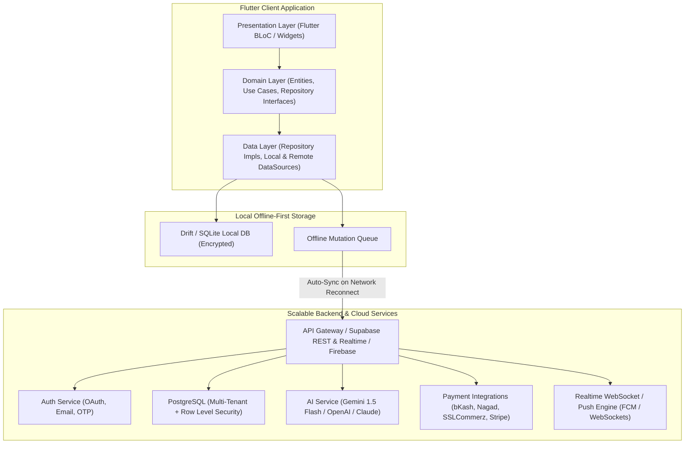
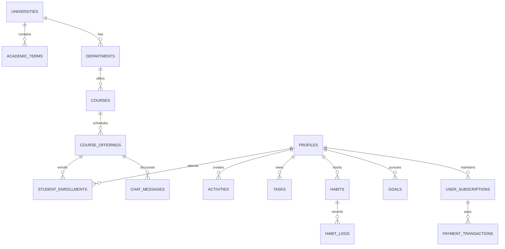

```mermaid
graph TD
    Root["🎯 Routine Flow Platform"] --> Uni["🏫 University Stream"]
    Root --> Pers["⚡ Personal Stream"]
    Root --> Intel["🤖 Intelligence Layer"]
    Root --> Collab["💬 Collaboration & Social"]
    Root --> Pay["💳 Monetization & Payments"]

    Uni --> U1["Auto-import Academic Routine"]
    Uni --> U2["Course Offerings & Section Sync"]
    Uni --> U3["Exam Countdown & Deadlines"]
    Uni --> U4["Class Announcements & CR Updates"]

    Pers --> P1["Flexible & Fixed Daily Habits"]
    Pers --> P2["Ad-hoc Tasks & Prioritization"]
    Pers --> P3["Daily Goal Alignment"]
    Pers --> P4["Focus Timers & Streaks"]

    Intel --> I1["AI Routine Parser (OCR/PDF/Text)"]
    Intel --> I2["Clash & Conflict Detection"]
    Intel --> I3["Adaptive Free-Time Slot Allocation"]
    Intel --> I4["Intelligent Habit Nudges"]

    Collab --> C1["Class Study Circles"]
    Collab --> C2["Realtime Group Discussion"]
    Collab --> C3["Resource & Note Sharing"]

    Pay --> M1["Freemium Core Student Tier"]
    Pay --> M2["Pro AI Student Subscription"]
    Pay --> M3["Local Payments (bKash/Nagad/SSLCommerz)"]
    Pay --> M4["Global Cards & App Stores"]
```

<p align="center">
  
</p>

<h1 align="center">ROUTINE FLOW</h1>

<p align="center">
  <strong>Personal Routine + University Routine = One Unified Daily Schedule</strong>
</p>

<p align="center">
  <em>Answering one vital question with precision: "What should I do now, and what do I need to do next?"</em>
</p>

<p align="center">
  
  
  
  
  
</p>

---

## 📑 Table of Contents
1. [Executive Overview & Philosophy](#-executive-overview--philosophy)
2. [Why Routine Flow? (The Problem & Solution)](#-why-routine-flow-the-problem--solution)
3. [Core Feature Ecosystem](#-core-feature-ecosystem)
4. [High-Level System Architecture](#-high-level-system-architecture)
5. [Modular Blueprint & Technical Implementation](#-modular-blueprint--technical-implementation)
   - [A. Unified Calendar & Smart Conflict Detection](#a-unified-calendar--smart-conflict-detection)
   - [B. AI Intelligence & Automated Assistant Engine](#b-ai-intelligence--automated-assistant-engine)
   - [C. Realtime Chat & Class Collaboration System](#c-realtime-chat--class-collaboration-system)
   - [D. Payment Gateway & Monetization Architecture](#d-payment-gateway--monetization-architecture)
   - [E. Offline-First Database & Cloud Sync Engine](#e-offline-first-database--cloud-sync-engine)
6. [Database Schema & Multi-Tenant Design](#-database-schema--multi-tenant-design)
7. [Repository File & Codebase Structure](#-repository-file--codebase-structure)
8. [Getting Started & Installation](#-getting-started--installation)
9. [Documentation Suite](#-documentation-suite)
10. [Future Roadmap](#-future-roadmap)

---

## 🌟 Executive Overview & Philosophy

Modern university students lead fragmented lives. Their academic timetable is managed via university portals, PDF routine sheets, or messaging groups, while their personal tasks, habits, gym routines, and exam preparation live in separate to-do apps, calendars, or notebook entries.

**Routine Flow** eliminates this cognitive overload by uniting academic schedules, university announcements, personal habits, time-blocked daily goals, and exam countdowns into a single, cohesive, offline-capable application.



---

## 🎯 Why Routine Flow? (The Problem & Solution)

| Student Challenge | Traditional Workaround | Routine Flow Unified Solution |
| :--- | :--- | :--- |
| **Scattered Routines** | Checking WhatsApp for class updates + Google Calendar for personal tasks | **Unified Daily Timeline**: Class periods & personal blocks merge seamlessly into "My Day". |
| **Schedule Clashes** | Overbooking personal appointments during rescheduled classes | **Zero-Clash Algorithm**: Instant conflict detection with automated alternatives. |
| **Manual Routine Entry** | Typing 40+ class slots every semester | **AI Routine Ingestion**: Parse PDF/Image timetable into structured database in seconds. |
| **No Internet in Classrooms** | Inaccessible cloud-only apps | **Offline-First Drift SQLite**: Full functionality offline with zero latency and automatic sync. |
| **Class Communication** | Lost notice board announcements | **Realtime Class Channels**: Dedicated course & batch chat rooms with pinned deadlines. |

---

## 🚀 Core Feature Ecosystem

```mermaid
graph TD
    A["📱 Routine Flow Core"] --> B["📅 Unified Schedule Engine"]
    A --> C["🎓 University Integration Hub"]
    A --> D["⚡ Task & Habit Tracker"]
    A --> E["🤖 AI Smart Planner"]
    A --> F["💬 Real-Time Collaboration"]
    A --> G["💳 Flexible Payment Engine"]

    B --> B1["'My Day' Live Timeline"]
    B --> B2["Visual Free-Time Calculator"]
    B --> B3["Conflict Resolution Dialog"]

    C --> C1["Multi-University & Department Roster"]
    C --> C2["Class Routines & Room Allocations"]
    C --> C3["Exam Schedules & Assignment Counters"]

    D --> D1["Habit Streaks & Completion Logs"]
    D --> D2["Time-Blocked Priority Tasks"]
    D --> D3["Interactive Checklists"]

    E --> E1["Natural Language Schedule Generation"]
    E --> E2["Syllabus to Study-Plan Decomposition"]
    E --> E3["Daily Productivity Audit"]

    F --> F1["Batch & Section Chatrooms"]
    F --> F2["Course-Wise Q&A Channels"]
    F --> F3["Peer-to-Peer Direct Messaging"]

    G --> G1["Mobile Financial Services (bKash, Nagad)"]
    G --> G2["International Cards (Stripe, SSLCommerz)"]
    G --> G3["In-App Purchases (Google Play, Apple Store)"]
```



---

## 🏗️ High-Level System Architecture

Routine Flow is built following **Clean Architecture principles** and the **Offline-First Reactive Paradigm**:



---

## 📐 Modular Blueprint & Technical Implementation

This section details how every subsystem is engineered, how current mock/prototype services operate, and how production APIs are seamlessly plugged in.

### A. Unified Calendar & Smart Conflict Detection
- **Time Complexity**: $\mathcal{O}(N \log N)$ interval overlap verification.
- **Algorithm**: Validates that no two activities $[S_1, E_1]$ and $[S_2, E_2]$ satisfy $S_1 < E_2 \land S_2 < E_1$.
- **Free Slot Search**: Computes $[E_i, S_{i+1}]$ throughout the operating day $(06:00 - 23:00)$ and identifies ideal gaps for study sessions and habits.

### B. AI Intelligence & Automated Assistant Engine
- **Implementation Blueprint**:
  - **OCR Timetable Ingestion**: Uses Gemini Vision / OCR API to convert image schedules into structured JSON schema (`UniversityRoutineSlot`).
  - **Dynamic Schedule Generator**: Accepts natural language prompts (e.g., *"I have an exam on Friday, allocate 2 hours of daily study for Physics"*), checks free-time gaps, and creates scheduled time-blocks automatically.
  - **Edge Function Support**: Deno Edge Function in `supabase/functions/ai-planner` interfacing with Google Generative AI API (`gemini-1.5-flash`).

### C. Realtime Chat & Class Collaboration System
- **Channel Structure**:
  - **University Batch Group**: Read-only announcements by Class Representatives (CR).
  - **Course Channels**: Discussion for individual subjects (e.g., `CSE-301: Database Systems`).
  - **Peer Direct Messaging**: 1-on-1 private messaging between classmates.
- **Backend Architecture Options**:
  1. **Supabase Realtime**: Broadcast & Postgres Changes with RLS-guaranteed isolation.
  2. **Firebase Firestore / Cloud Messaging**: Real-time snapshot listeners + FCM background alerts.
  3. **Custom WebSocket Server (Node.js/Go)**: High-throughput Socket.io microservice.

### D. Payment Gateway & Monetization Architecture
- **Tier Structure**:
  - **Free Tier**: Full routine management, manual task & habit tracking, local offline storage.
  - **Pro Tier ($1.99/mo or ৳150/mo)**: AI Automated Timetable Parser, Advanced Conflict Resolution, Cloud Multi-Device Sync, Unlimited Study Groups.
  - **University Enterprise**: Custom institutional tenant with automatic student enrollment sync.
- **Supported Payment Gateways**:
  - **Bangladesh MFS**: bKash Tokenized Checkout API, Nagad Direct Pay.
  - **Regional Aggregator**: SSLCommerz, Shurjopay.
  - **Global & App Stores**: Stripe Checkout, Google Play Billing (`in_app_purchase`), Apple StoreKit.

### E. Offline-First Database & Cloud Sync Engine
- **Local Engine**: Drift (SQLite) ensuring instant $(<16\text{ms})$ frame updates and complete offline usability.
- **Synchronization Protocol**:
  - Every create/update/delete operation writes locally and enqueues a mutation record in `sync_queue`.
  - When network status transitions to `online`, `SyncEngine` replays pending mutations with idempotent upserts.
  - Server timestamps (`updated_at`) resolve conflicts via Last-Write-Wins (LWW) or client-prompted resolution.

---

## 🗄️ Database Schema & Multi-Tenant Design

The database is built on PostgreSQL with Row-Level Security (RLS) guaranteeing strict data isolation:



---

## 📂 Repository File & Codebase Structure

```
ROUTINEFLOW-APP/
├── assets/
│   ├── icons/                   # App icons & vector assets
│   └── images/
│       ├── logo.png             # Official Routine Flow branding
│       └── app_logo.png         # High-res vector render
├── lib/
│   ├── app/
│   │   ├── config/              # App environment configs & constants
│   │   ├── router/              # Declarative GoRouter routing table
│   │   └── theme/               # Modern dark/light typography & palette
│   ├── core/
│   │   ├── database/            # Drift SQLite offline database schema
│   │   ├── errors/              # AppException & Failure hierarchy
│   │   ├── network/             # Network connectivity listener
│   │   ├── responsive/          # Adaptive layout (Mobile/Tablet/Desktop)
│   │   ├── services/            # Notification & local storage services
│   │   └── sync/                # Offline mutation sync engine
│   ├── features/
│   │   ├── activities/          # Schedule timeline, calendar & clash engine
│   │   ├── ai_planner/          # AI prompt interfaces & plan generators
│   │   ├── auth/                # Login, registration, splash & onboarding
│   │   ├── collaboration/       # Real-time study groups & class chat
│   │   ├── goals/               # Long-term academic & life objectives
│   │   ├── habits/              # Habit tracking, streaks & daily logs
│   │   ├── home/                # 'My Day' unified operational cockpit
│   │   ├── subscription/        # Monetization, checkout & tier management
│   │   ├── tasks/               # Priority task manager & checklists
│   │   └── university/          # Routine explorer, courses & exams
│   └── shared/
│       └── widgets/             # Reusable UI cards, buttons, AppLogo, dialogs
├── supabase/
│   ├── migrations/              # 001_schema, 002_rls, 003_seed
│   └── functions/               # AI planner Deno edge function
├── test/                        # Unit, widget & integration tests
├── ARCHITECTURE.md              # Detailed software engineering design
├── CODE_MAP.md                  # Comprehensive file-by-file index
├── PRD.md                       # Product Requirements Document
├── SRS.md                       # Software Requirements Specification
├── SYSTEM_BLUEPRINT.md          # Implementation guide for AI, DB, Payments & Chat
└── SETUP_GUIDE.md               # Local environment setup & build manual
```

---

## 🚀 Getting Started & Installation

### Prerequisites
- **Flutter SDK**: `>= 3.27.0` ([Installation Guide](https://docs.flutter.dev/get-started/install))
- **Dart SDK**: `>= 3.6.0`
- **Android Studio** / **VS Code** with Flutter extensions
- **Connected Physical Device** or **Android/iOS Emulator**

### Quickstart Commands
```bash
# 1. Clone the repository
git clone https://github.com/Ti838/RoutineFlow-App.git
cd RoutineFlow-App

# 2. Install dependencies
flutter pub get

# 3. Run all tests to ensure zero regressions
flutter test

# 4. Analyze code quality
dart analyze

# 5. Run on your connected device
flutter run
```

---

## 📚 Documentation Suite

| Document | Purpose |
| :--- | :--- |
| [📘 **PRD.md**](PRD.md) | Product strategy, user personas, UX philosophy, and business KPIs. |
| [📐 **SRS.md**](SRS.md) | IEEE 830-compliant software requirements, formulas, and security specs. |
| [🏛️ **ARCHITECTURE.md**](ARCHITECTURE.md) | Clean Architecture patterns, state management, and caching strategies. |
| [🛠️ **SYSTEM_BLUEPRINT.md**](SYSTEM_BLUEPRINT.md) | Detailed technical integration guide for AI, Databases, Payments & Chat. |
| [🗺️ **CODE_MAP.md**](CODE_MAP.md) | Comprehensive index of every source file, class, and method. |
| [⚙️ **SETUP_GUIDE.md**](SETUP_GUIDE.md) | Step-by-step local machine and backend deployment manual. |

---

## 🗺️ Future Roadmap

- [x] **Phase 1: Foundation (Current MVP)**
  - Unified My Day dashboard uniting university + personal blocks.
  - Offline-first SQLite database with conflict detection algorithms.
  - Official brand icon integration across all operating systems.
- [ ] **Phase 2: Full Realtime Cloud & Chat Collaboration**
  - Supabase/Firebase live synchronization.
  - Class batch & course-specific chatrooms for instant notice sharing.
- [ ] **Phase 3: Deep AI Assistant & Timetable OCR**
  - Instant PDF/Image timetable import with Gemini Vision OCR.
  - Natural language conversational assistant for daily productivity.
- [ ] **Phase 4: Monetization & University Portals**
  - bKash, Nagad, Stripe checkout integrations.
  - Institutional Admin Portal for automatic department routine publishing.

---

<p align="center">
  <strong>Routine Flow</strong> &copy; 2026. Built with precision for students worldwide.
</p>
