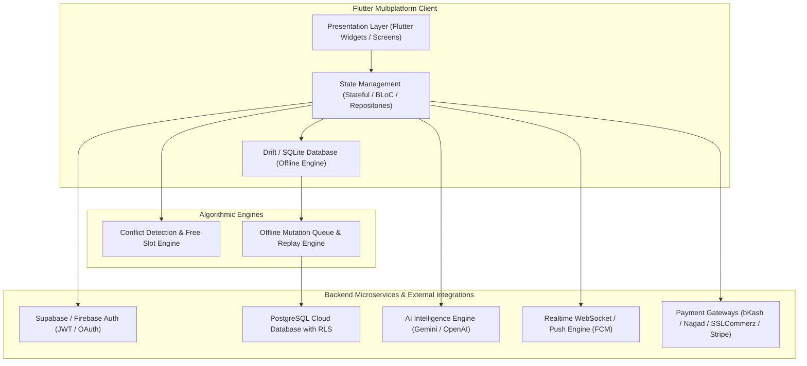

# ROUTINE FLOW — Software Requirements Specification (SRS)
*Standard: IEEE 830 / ISO/IEC/IEEE 29148 Compliant*

  

## 1. Introduction

### 1.1 Purpose
This Software Requirements Specification (SRS) establishes the formal functional, non-functional, behavioral, and architectural requirements for **ROUTINE FLOW** — a cross-platform (Android, iOS, Web, Desktop) unified scheduling, academic management, collaboration, and productivity application.

### 1.2 Scope
Routine Flow delivers a unified temporal engine merging fixed university class schedules with flexible personal habits, prioritized task management, exam tracking, peer collaboration channels, AI-assisted timetable parsing, and localized/global payment processing.

---

## 2. Overall System Description & Architecture

---

## 3. Specific Functional Requirements

### 3.1 Module 1: Unified Schedule & Conflict Engine (FR-SCHED)
- **FR-SCHED-01**: The system shall combine academic routine slots and personal activities into a single chronological timeline.
- **FR-SCHED-02 (Conflict Formula)**: Two events $A = [S_A, E_A]$ and $B = [S_B, E_B]$ are classified as a conflict if:
  $$\text{Conflict}(A, B) = (S_A < E_B) \land (S_B < E_A)$$
- **FR-SCHED-03 (Free Slot Discovery)**: The system shall calculate all idle intervals $[E_i, S_{i+1}]$ where $(S_{i+1} - E_i) \ge 45\text{ minutes}$ during active hours $(06:00 - 23:00)$ and present them as candidate focus blocks.

### 3.2 Module 2: AI Intelligence & Timetable Ingestion (FR-AI)
- **FR-AI-01**: The AI service shall ingest uploaded timetable images/PDFs and extract structured entities matching the `UniversityRoutineSlot` model.
- **FR-AI-02**: The AI assistant shall accept natural language commands to automatically schedule revision slots for upcoming exams without creating schedule conflicts.

### 3.3 Module 3: Realtime Class Chat & Study Groups (FR-CHAT)
- **FR-CHAT-01**: Enrolled students shall be automatically placed into their respective batch announcement and course discussion rooms.
- **FR-CHAT-02**: Class Representatives (CR) and faculty shall have permissions to pin announcements and schedule updates.
- **FR-CHAT-03**: Students shall be able to initiate 1-on-1 direct peer chats for study discussions.

### 3.4 Module 4: Payment Processing & Monetization (FR-PAY)
- **FR-PAY-01**: The system shall support Mobile Financial Services (bKash Tokenized Checkout, Nagad Direct Pay) for local subscription activation.
- **FR-PAY-02**: The system shall support SSLCommerz / Shurjopay for domestic credit/debit card processing.
- **FR-PAY-03**: The system shall support Stripe Checkout, Google Play Billing, and Apple StoreKit for international in-app purchases.
- **FR-PAY-04**: Upon successful payment callback or webhook verification, the student's account tier shall be immediately elevated to `PRO`.

### 3.5 Module 5: Offline-First Data Persistence & Cloud Sync (FR-SYNC)
- **FR-SYNC-01**: All user actions (CRUD on activities, habits, tasks) shall write immediately to the local Drift SQLite database.
- **FR-SYNC-02**: Mutations executed while offline shall be appended to `sync_queue` with idempotency keys.
- **FR-SYNC-03**: When network connectivity is re-established, `SyncEngine` shall replay pending mutations in chronological sequence.

---

## 4. Non-Functional Requirements (NFR)

### 4.1 Performance & Latency
- **NFR-PERF-01**: Local database queries shall complete in under $16\text{ms}$ to maintain 60/120 FPS UI fluidity.
- **NFR-PERF-02**: Cold boot time shall not exceed $1.2\text{ seconds}$ on mid-range Android devices.

### 4.2 Security & Data Privacy
- **NFR-SEC-01**: Cloud data access shall be guarded by PostgreSQL Row-Level Security (RLS) enforcing `auth.uid() = user_id`.
- **NFR-SEC-02**: Sensitive auth tokens and encryption keys shall be stored in Android Keystore / iOS Keychain via Flutter Secure Storage.

### 4.3 Reliability & Availability
- **NFR-REL-01**: The application shall remain fully functional in offline mode without throwing fatal crashes.
