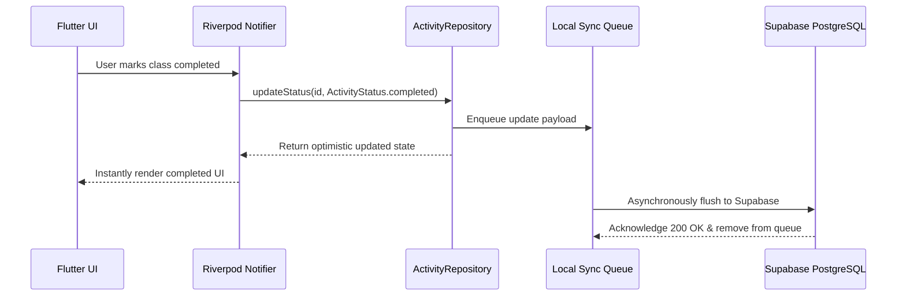

# ROUTINE FLOW — Software Requirements Specification (SRS)

## 1. System Overview & Scope
Routine Flow is a cross-platform (Android, iOS, Web, macOS, Linux, Windows) application developed in Flutter and Dart, backed by a Supabase PostgreSQL infrastructure with client-side SQLite/Drift offline-first persistence and Google Gemini LLM synthesis.

---

## 2. Functional Requirements

### 2.1 Authentication & RBAC (REQ-AUTH)
- **REQ-AUTH-01**: System shall authenticate users via Email/Password, Supabase Auth tokens, and session recovery.
- **REQ-AUTH-02**: System shall enforce Role-Based Access Control (`student`, `faculty`, `university_admin`, `super_admin`).
- **REQ-AUTH-03**: System shall securely store access tokens in `FlutterSecureStorage`.

### 2.2 Activity & Scheduling Engine (REQ-SCHED)
- **REQ-SCHED-01**: The system shall represent all daily commitments as `Activity` models with `startTime`, `endTime`, `category`, and `isUniversity` flags.
- **REQ-SCHED-02**: `ConflictDetectionService` shall deterministically detect overlaps:
  $$\text{Conflict} \iff (\text{Start}_A < \text{End}_B) \land (\text{End}_A > \text{Start}_B) \land (\text{Date}_A = \text{Date}_B)$$
- **REQ-SCHED-03**: `FreeTimeService` shall compute unallocated intervals exceeding a configurable threshold (default: 30 minutes) within the user's active day window.

### 2.3 Offline-First Synchronization (REQ-SYNC)
- **REQ-SYNC-01**: All mutations (`insert`, `update`, `delete`) shall write immediately to local storage.
- **REQ-SYNC-02**: Every mutation shall enqueue a `SyncQueueItem` record.
- **REQ-SYNC-03**: `SyncEngine` shall flush queued mutations on network reconnect using exponential backoff retry.

### 2.4 AI Routine Synthesis (REQ-AI)
- **REQ-AI-01**: Client shall invoke `/functions/v1/ai-planner` with structured JSON payloads.
- **REQ-AI-02**: The server edge function shall prompt Gemini 1.5 Flash and return strictly validated JSON matching the client schema.
- **REQ-AI-03**: All token consumption shall be logged in `ai_usage_logs` for quota enforcement.

---

## 3. Non-Functional Requirements

### 3.1 Performance Benchmarks
- **Cold Start Time**: $\le 1.2$ seconds on modern mobile devices.
- **Timeline Render Latency**: $\le 16$ ms (60 FPS minimum, 120 FPS capable).
- **Offline Query Latency**: $\le 10$ ms for local SQLite reads.

### 3.2 Security & Compliance
- **Row-Level Security (RLS)**: Zero personal schedule data accessible across users.
- **Credential Safety**: No hardcoded API keys or service role secrets in the client codebase.

---

## 4. Data Flow Architecture

