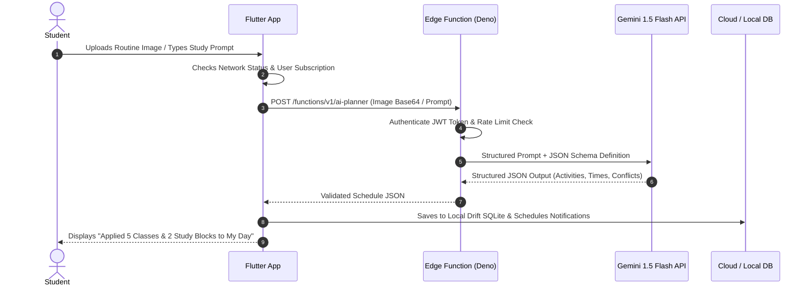
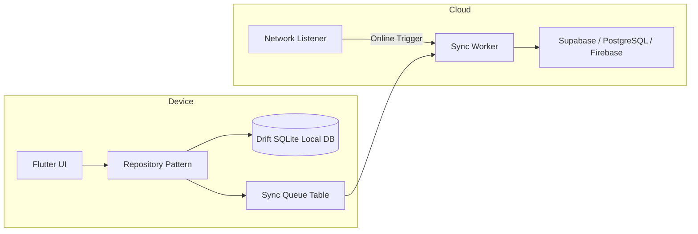
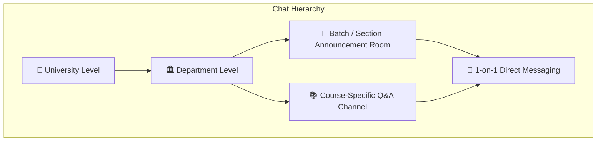
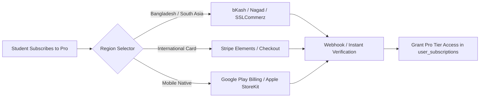

# 🛠️ Routine Flow: System Integration & Engineering Blueprint

This document provides a comprehensive technical blueprint detailing how external subsystems (AI Intelligence Engine, Production Cloud Databases, Realtime Chat & Collaboration, and Payment Gateways) are architected, integrated, and scaled in Routine Flow.

---

## 📑 Index
1. [AI Intelligence Engine Architecture](#1-ai-intelligence-engine-architecture)
2. [Database Strategy (Local Offline + Cloud Multi-Tenant)](#2-database-strategy-local-offline--cloud-multi-tenant)
3. [Realtime Chat & Peer Collaboration Architecture](#3-realtime-chat--peer-collaboration-architecture)
4. [Payment Gateway & Monetization Integration Guide](#4-payment-gateway--monetization-integration-guide)
5. [Security, Auth & Compliance Blueprint](#5-security-auth--compliance-blueprint)

---

## 1. AI Intelligence Engine Architecture

Routine Flow uses a hybrid client-edge AI pipeline designed to minimize latency and token costs while providing maximum student productivity.



### Supported AI Use Cases & Providers
1. **Automated Timetable Parser (OCR to Database)**:
   - Input: PDF, PNG, JPG of university class schedules.
   - AI Model: `gemini-1.5-flash` or `gpt-4o-mini` with Vision.
   - Output: Strict JSON matching `List<UniversityRoutineSlot>`.
2. **Smart Exam Study Plan Generator**:
   - Analyzes remaining days before an exam, identifies student's free-time gaps in `My Day`, and schedules 45-minute Pomodoro study blocks automatically.
3. **Conversational Routine Assistant**:
   - Handles natural language queries like *"Reschedule my gym to tomorrow morning"* or *"When is my next Database Systems quiz?"*.

---

## 2. Database Strategy (Local Offline + Cloud Multi-Tenant)

To ensure students in low-connectivity classrooms never experience loading spinners or data loss, Routine Flow implements a resilient dual-layer data architecture:



### Database Comparison & Selection Guide

| Requirement | Drift SQLite (Local) | Supabase PostgreSQL (Cloud) | Firebase Firestore (Alternative) |
| :--- | :--- | :--- | :--- |
| **Primary Role** | Offline persistence & instant UI render | Relational cloud sync & RLS security | NoSQL cloud backup option |
| **Query Speed** | $<10\text{ms}$ | $50-150\text{ms}$ | $80-200\text{ms}$ |
| **Security** | Local device encryption | PostgreSQL Row Level Security | Firestore Security Rules |
| **Complex Joins** | Full SQL joins supported | Full multi-tenant relational schema | Denormalized documents |

---

## 3. Realtime Chat & Peer Collaboration Architecture

University students require fast, structured communication regarding room changes, assignment cancellations, and study group discussions.



### Technical Implementation Approaches
1. **Supabase Realtime (Recommended)**:
   - Uses PostgreSQL `LISTEN/NOTIFY` via WebSockets.
   - RLS policies automatically prevent students outside section `CSE-301-B` from reading course messages.
2. **Firebase Cloud Messaging + Firestore**:
   - Realtime document snapshots with background push notification badges.
3. **P2P Audio/Video Study Rooms (Future)**:
   - WebRTC / Agora SDK integration for collaborative study sessions.

---

## 4. Payment Gateway & Monetization Integration Guide

Routine Flow is built for both emerging markets (Bangladesh/South Asia) and international global students:



### Integration Details
1. **bKash Tokenized Checkout API**:
   - `createPayment` -> `executePayment` -> Instant webhook callback.
   - Subscription price: ৳150/month or ৳1,200/year.
2. **Nagad Payment Gateway**:
   - Encrypted order initialization with public-private key validation.
3. **SSLCommerz Multi-Gateway**:
   - Unified support for Visa, MasterCard, UnionPay, Rocket, Upay.
4. **Stripe & In-App Purchases**:
   - `flutter_inapp_purchase` for seamless one-tap Play Store / App Store recurring subscriptions.

---

## 5. Security, Auth & Compliance Blueprint

- **Zero-Trust Client Security**: Local database encrypted using `sqlcipher` keys stored in Flutter Secure Storage.
- **Row-Level Security (RLS)**:
  ```sql
  -- Student can only access their own activities
  CREATE POLICY "Student activity isolation" 
  ON activities FOR ALL 
  USING (auth.uid() = user_id);
  ```
- **JWT Authentication**: OAuth 2.0 (Google Sign-In, Apple ID) + Email Magic Links.
